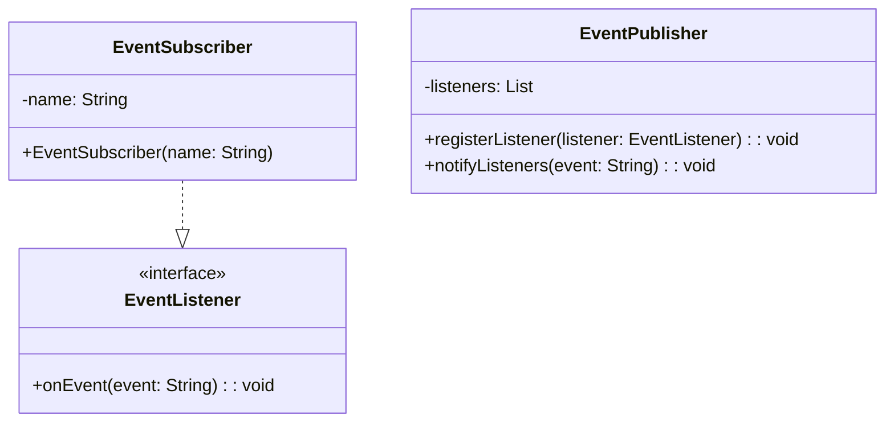

Ejemplo de un sistema de eventos y notificaciones sencillo

```mermaid
classDiagram
    class EventListener {
        <<interface>>
        +onEvent(event: String): void 
    }

    class EventSubscriber {
        -name: String
        +EventSubscriber(name: String)
    }

    class EventPublisher {
        -listeners: List<EventListener>
        +registerListener(listener: EventListener): void
        +notifyListeners(event: String): void
    }

    EventSubscriber ..|> EventListener
```
