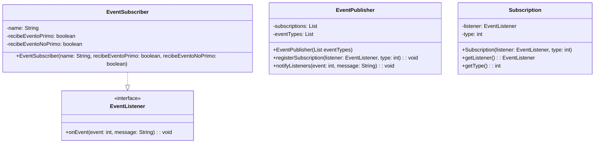

Ejemplo que aplica el sistema de eventos de 2 tipos diferentes y multiples suscriptores sobre si un número es primo o no

```mermaid
classDiagram
    class EventListener {
        <<interface>>
        +onEvent(event: int, message: String): void 
    }

    class EventSubscriber {
        -name: String
        -recibeEventoPrimo: boolean
        -recibeEventoNoPrimo: boolean
        +EventSubscriber(name: String, recibeEventoPrimo: boolean, recibeEventoNoPrimo: boolean)
    }

    class EventPublisher {
        -subscriptions: List<Subscription>
        -eventTypes: List<Integer>
        +EventPublisher(List<Integer> eventTypes)
        +registerSubscription(listener: EventListener, type: int): void
        +notifyListeners(event: int, message: String): void
    }

    class Subscription {
        -listener: EventListener
        -type: int
        +Subscription(listener: EventListener, type: int)
        +getListener(): EventListener
        +getType(): int
    }

    EventSubscriber ..|> EventListener
```